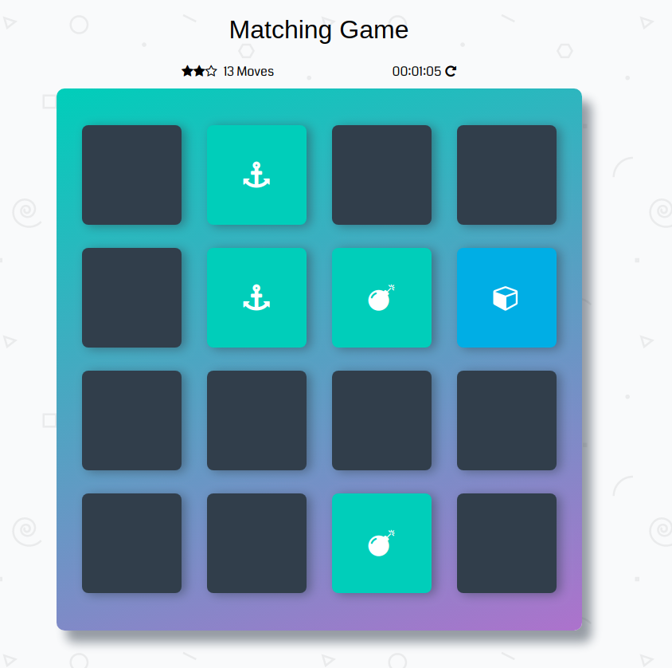

# Memory Game Project

MemoryGame is Single Page App

Memory-Game board consists of sixteen "cards". The deck is made up of eight different pairs of cards. The game play rules are very simple: flip over two hidden cards at a time to locate the ones that match! The game ends once all cards have been correctly matched.

## Get Started

Click on this [link](https://abdsamadf.github.io/memory-game) to see the website **or** you can download or clone the project, and loading up the index.html file in your browser.

## Technology Used

* Vanilla JS
* jQuery
* HTML5
* CSS3
* CSS Animation [animate.css](https://daneden.github.io/animate.css)
* Animated Modal [animatedModal.js](https://joaopereirawd.github.io/animatedModal.js)

## Code Style

## Fancy Looking Matching Game

## Contributing
Contributions are always welcome! Please read the [contribution guidelines](CONTRIBUTING.md) first.

## License 

The contents of this repository are covered under a [MIT License](https://github.com/abdsamadf/memory-game/blob/master/LICENSE).
